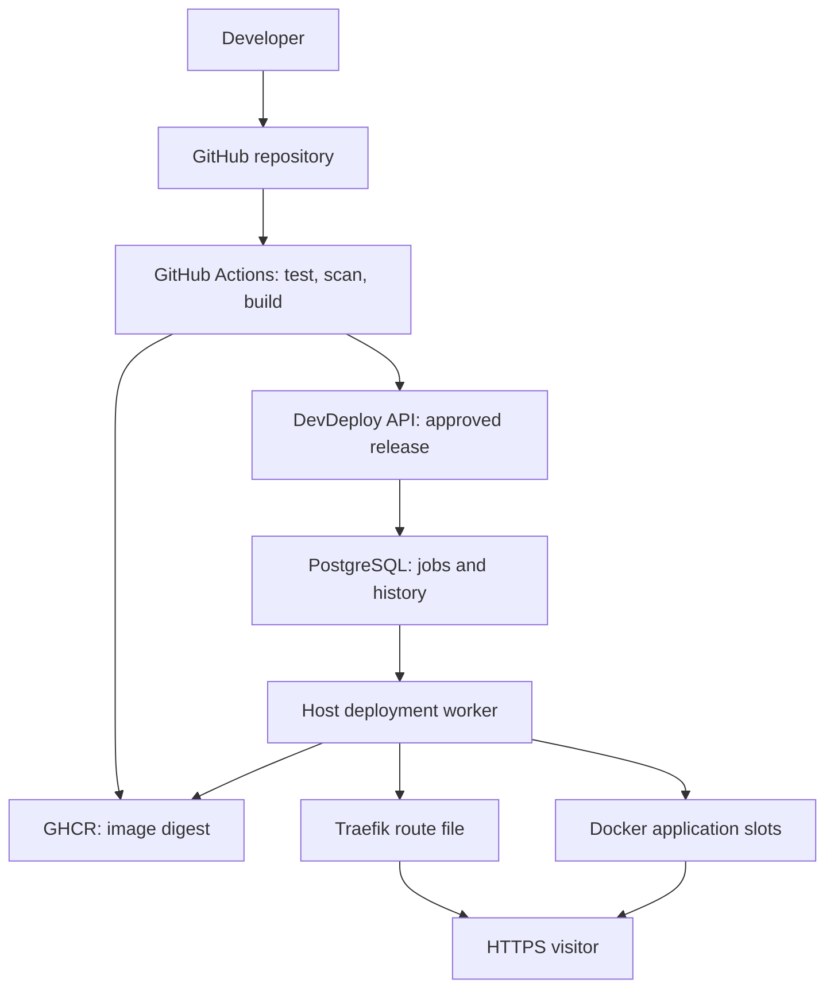
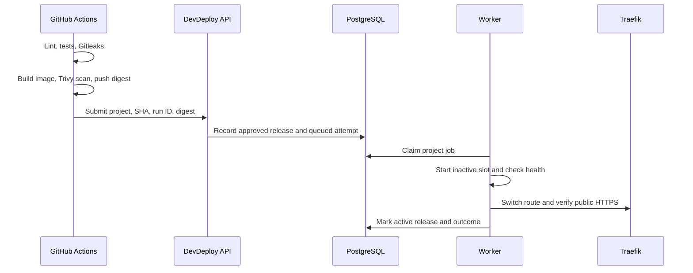
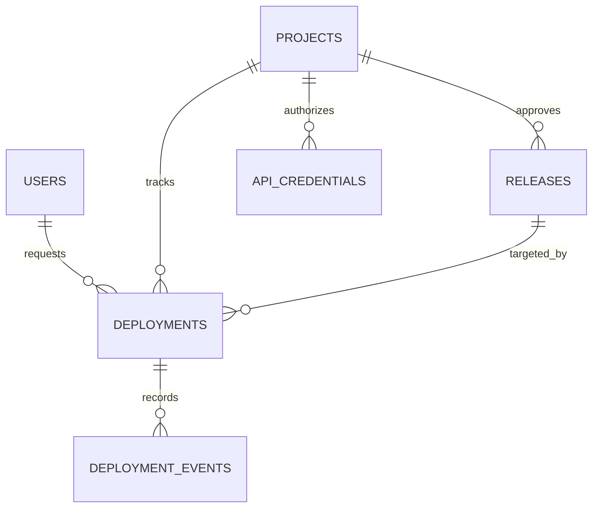

# DevDeploy — Complete Practicum Specification

**Project title:** Automated Deployment Platform for Secure and Observable Web Applications  
**Short name:** DevDeploy  
**Document status:** Implementation baseline  
**Date:** 28 September 2026  
**Delivery constraint:** One developer, ten weeks, one Ubuntu host

## 1. What you are building

DevDeploy is a small, self-hosted deployment platform. A developer pushes an update to a selected GitHub repository. GitHub Actions tests it, scans it, builds an image, and publishes that image to GitHub Container Registry (GHCR). DevDeploy receives the approved image reference, runs a new container on an Ubuntu server, checks it, switches HTTPS traffic, and records the result. If the new release fails, DevDeploy restores the previous healthy route. A dashboard shows projects, versions, deployment history, health, and links to metrics and logs.

**Your original software** is the NestJS control API, a deployment worker, the PostgreSQL data model, a small Next.js dashboard, integration scripts/configuration, and tests. GitHub Actions, Docker, Traefik, Prometheus, Grafana, Loki, and Alloy are existing tools configured and orchestrated by your software.

**The MVP proves one complete path with one sample stateless HTTP application and one server.** The data model can represent more than one project, but running arbitrary customer applications or many independent servers is outside the release target.

### Demonstration application contract

`student-api` must be stateless: no local file is required for correctness, and it never writes persistent business data to its container filesystem. If a later version uses a database or an external service, that dependency and its backup/migration strategy are separate from DevDeploy's platform database backup. Its HTTP contract is:

| Endpoint | Healthy response | Use |
| --- | --- | --- |
| `GET /health` | HTTP `200`, JSON `{"status":"ok"}` | Candidate and live readiness probe; unhealthy versions return an error or fail to respond |
| `GET /version` | HTTP `200`, JSON `{"commitSha":"<40-character Git SHA>","version":"v1"}` | Confirm that the container and public route serve the expected build |

The worker compares `/version.commitSha` to the release record after switching routes. Health alone cannot prove that Traefik is serving the new slot.

### One-sentence answer for the lecturer

> I am developing a self-hosted deployment platform that tests and scans a Dockerized application, deploys an approved image to one server, checks its health, switches HTTPS traffic, restores the previous version after a failed release, and records metrics, logs, and deployment history.

### Worked example

1. `student-api` serves version `a1b2c3d` at `https://demo.example.com`.
2. A developer pushes commit `e4f5a6b` to a protected branch.
3. GitHub Actions runs quality and security checks, builds the image, scans it, and publishes `ghcr.io/OWNER/student-api@sha256:...`.
4. DevDeploy starts the new image in an inactive slot and checks `/health`.
5. If healthy, Traefik points the public route at the new slot; the dashboard records success.
6. If the container or public route fails, the route stays on or returns to `a1b2c3d`; the failed attempt remains visible.

## 2. Problem, users, and goals

### Problem

Small teams commonly release with manual SSH commands. That makes deployment dependent on the operator, can expose secrets, interrupts service when containers are stopped first, and provides weak evidence about which commit is running. Recovery can take longer when the last working image and configuration are not recorded. A running container also does not prove the HTTP application is serving requests.

### Actors

| Actor | Needs | MVP access |
| --- | --- | --- |
| Platform administrator | Register the sample project, view releases, deploy an approved release, request rollback, inspect failures | Authenticated dashboard and API |
| Application developer | Push code and see CI/deployment result | GitHub repository and read-only deployment view through administrator account |
| GitHub Actions workflow | Submit a verified image digest and commit for release | Scoped machine credential for one project; no Docker access |
| Deployment worker | Pull images, run containers, check health, switch routes, recover after failures | Host-local process with Docker privileges; no public HTTP endpoint |
| Visitor | Reach the current healthy application | HTTPS application domain only |

### Measurable outcomes

| ID | Outcome | Verification |
| --- | --- | --- |
| G1 | A protected-branch push launches tests, scans, build, and release | Observe a successful GitHub Actions run and matching commit/digest in DevDeploy |
| G2 | A failed test or secret scan prevents release | Run safe fixtures in an isolated demonstration branch; no deployment record with a runnable digest |
| G3 | A valid release goes live via HTTPS | Confirm the response version and certificate after a healthy rollout |
| G4 | A bad release preserves the last healthy version | Deploy an image whose health endpoint fails; inspect public response and failure events |
| G5 | A manual rollback restores a previously successful release | Select a stored release and verify public version and history |
| G6 | The operator can locate a failure | Read deployment events, Grafana metrics, and Loki logs for the same project/time |
| G7 | Platform data is recoverable | Restore a backup into an isolated database and compare project and deployment counts |

### Non-functional acceptance targets

On the reference demonstration host, the sample app should handle a sustained **1 request/second for 10 minutes** while the platform records metrics and logs. The release flow should complete **20 sequential deployments within a day** without unbounded image/log growth or disk exhaustion. These are practicum targets, not a production capacity claim. Measure disk before/after, worker memory, deployment durations, and application errors; report actual results and any failure instead of silently lowering the target.

## 3. Scope and boundaries

### Committed MVP

- Single Ubuntu host; Docker Engine and Compose; one Traefik HTTPS entry point.
- One administrator account, seeded securely; login and authenticated dashboard.
- One managed sample application at one domain, with a `/health` endpoint and visible version.
- Project registration restricted to a configured repository, image namespace, domain, container port, and health path.
- GitHub Actions: lint, tests, Gitleaks, image build, Trivy image scan, push to GHCR, and authenticated release notification.
- Immutable image digest as the deployed identity; commit SHA and workflow run ID recorded.
- Host-local worker, per-project deployment serialization, inactive-slot start, internal health test, route switch, public health test, and automatic recovery.
- Manual deploy/redeploy of a **previously approved** release and manual rollback to a previous successful release.
- Deployment status, ordered events, and current release in PostgreSQL; Next.js pages to view them.
- Prometheus host/container/application metrics; Grafana dashboard; Docker application logs collected with Alloy to Loki and visible in Grafana.
- Platform PostgreSQL backup, scheduled retention, and one documented restore drill.
- Security baseline, reproducible local setup, CI evidence, failure tests, and final practicum documentation.

### Deferred features

| Feature | Why deferred |
| --- | --- |
| Public user registration, teams, RBAC, billing | One trusted operator is sufficient |
| Arbitrary GitHub repository onboarding and per-customer secrets | Requires stronger isolation and authorization |
| Multi-host scheduling, autoscaling, Kubernetes | Beyond one developer and one host |
| Automatic database schema rollback | Cannot safely reverse every migration; demo app is stateless |
| Preview environments and custom domain purchase | Does not advance core deployment proof |
| Terraform, Ansible, Telegram, email alerts | Optional after MVP acceptance |
| Generic CI designer or security scanner engine | GitHub Actions and existing scanners already provide these functions |

### Assumptions and limits

- The sample app is **stateless**; data persists only in the platform database. Deploying apps with stateful migrations or incompatible external dependencies requires a separate release strategy.
- One project deploys at a time. Multiple projects may exist in the schema, but multi-tenant isolation is not claimed.
- A single host is a single point of failure; rollback handles bad releases, not a dead server.
- Automatic rollback preserves availability after application health failures only when the old release and host remain usable. There can be a brief interruption during a route change; zero downtime is an objective measured in tests, not a blanket guarantee.
- CPU, memory, disk, logs, and deployment records have separate retention rules; a Grafana graph is not an audit log.

**Failure modes outside automatic rollback:** host hardware failure, OS or filesystem corruption, host/network/provider outage, and Docker or Traefik failure that prevents either slot or route from operating. Mitigate with tested platform DB backups, exported Compose templates and Traefik configuration, image digests retained in GHCR, and a manual recovery runbook. These mitigations shorten recovery; they do not make one host highly available.

## 4. Architecture and responsibility boundaries



**Control plane:** Next.js dashboard, NestJS API, PostgreSQL. It accepts administrator requests, validates workflow submissions, records releases/jobs, and presents state. Its public API container never mounts `/var/run/docker.sock`.

**Execution plane:** A host-local worker with Docker access consumes deployment jobs, validates again against an allowlist, runs Compose for the sample app, probes the inactive slot, writes a Traefik dynamic route file, and records events. Docker control is effectively host-level privilege, so keep the worker private and its credentials separate from the public API.

**Delivery plane:** A protected `ci.yml` workflow builds and scans, pushes to GHCR, and publishes a small release-manifest artifact containing repository, commit, CI run ID, and image digest. A separate `workflow_run: completed` release workflow runs only when CI concludes successfully for the configured `main` branch. It downloads that run's manifest and submits it to DevDeploy. Use a protected deployment environment and scoped credential. The release workflow never checks out or executes code from the completed run. GHCR access for private images requires an explicit read credential on the server; do not assume the workflow's temporary `GITHUB_TOKEN` works outside Actions.

**Provenance rule:** The API uses a read-only GitHub credential to query the stated CI workflow run and retrieve its manifest. It requires the run to be `completed/success`, a `push` on the configured protected branch from the configured repository and workflow, and matching repository/SHA/run ID/digest in the manifest and request. A missing, expired, or mismatched manifest fails closed. This ties the approved digest to a successful trusted CI run; simply knowing the DevDeploy submission token cannot authorize an arbitrary digest. The workflow file and protected branch remain part of the trust boundary. Artifact attestation for stronger build provenance can be added later; an attestation alone does not establish that tests and scans passed.

**Data plane:** Traefik terminates TLS and forwards to the active app slot. Use its **file provider** for generated routes; Traefik does not need the Docker socket. Platform API, database, metrics, Grafana, Loki, and Docker daemon access remain on private networks or behind authenticated administration access.

### Network and trust boundaries

| Boundary | Allowed operation | Rejected operation |
| --- | --- | --- |
| Internet → Traefik | HTTPS to demo app and authenticated dashboard/API | Direct access to PostgreSQL, Docker, Prometheus, Loki, or worker |
| GitHub Actions → API | Submit digest + SHA + workflow ID for one configured project | Arbitrary shell commands, Compose text, domains, or host paths |
| Dashboard → API | Authenticated project reads and approved release operations | User-provided Docker image or shell command |
| API → PostgreSQL | Read/write platform state, enqueue jobs | Docker daemon access |
| Worker → Docker/Traefik files | Exact whitelisted deployment operations | Unvalidated compose flags, host mounts, privileged containers |

## 5. Domain breakdown

| Domain | Owns | Main operations | Invariant / contract |
| --- | --- | --- | --- |
| Identity & access | Administrator session and API credentials | Login, logout, credential rotation | Only an authenticated administrator can initiate manual actions; workflow credential only submits a CI release |
| Project catalog | Repository, allowed GHCR namespace, domain, port, health path | Create, view, disable project | Domain/slug unique; immutable runtime rules generated from validated fields |
| Build admission | CI run ID, commit, image digest, manifest, scanner outcomes | Verify completed run and manifest; store approved artifact | Release must come from configured repository/branch/workflow, pass gates, match the run artifact, and use a digest from allowed GHCR namespace |
| Deployment orchestration | Pending jobs, per-project lock, worker lease | Queue, claim, retry after interruption | At most one in-flight deployment per project; repeated workflow notification is idempotent |
| Runtime & routing | Blue/green app slots and active Traefik route | Pull, start, check, route, retire | Last known healthy route is retained until new slot passes checks |
| Recovery | Last successful release and route snapshot | Automatic recovery, manual rollback | Failure never marks a bad digest as current; recovery outcome recorded separately |
| Observability | Metrics, logs, deployment events | Inspect uptime, requests, errors, logs | Events correlate via project ID, deployment ID, commit, and timestamp |
| Backup & audit | DB dumps, configuration copy, restore record | Backup, verify, restore drill | A backup is successful only after an isolated restore test |

### Domain ownership rules

- `projects` stores intended configuration. `releases` stores CI-approved artifact facts. `deployments` stores each attempt. `deployment_events` stores its ordered evidence. `projects.current_release_id` points to the **active** successful release and changes only after public verification.
- A rollback is a **new deployment attempt** targeting an earlier approved release. It does not erase the failed attempt, rewrite a release, or mutate an image tag.
- Logs and time-series metrics stay in Loki/Prometheus; PostgreSQL stores only the audit trail and pointers, not raw log streams.
- Only the worker changes the active route. The public API enqueues commands but cannot edit routing files.

## 6. End-to-end workflows

### 6.1 Onboarding the demonstration project

1. Administrator signs in and registers project slug, GitHub repository, protected branch, GHCR image namespace, HTTPS domain, internal port, and health path.
2. API validates syntax, allowlists namespace/domain, and rejects duplicate slug/domain.
3. Administrator provisions DNS, TLS, workflow environment secret, and any private GHCR pull credential out of band. Secrets are never entered into the project record.
4. Project remains `inactive` until the first successful deployment.

### 6.2 CI release and deployment



1. Trigger CI from the protected main branch; set workflow concurrency per project/environment. Run checks **before** publishing a usable release. A Trivy result is saved as a CI artifact; the agreed gate blocks `CRITICAL` findings with available fixes. An explicit, reviewed exception list may be used, never an unrecorded bypass.
2. Build the container, scan the built image, push it to GHCR, and extract its immutable `sha256` digest. Publish a release-manifest artifact for this run containing the digest and source identity. A human-readable SHA tag can exist for convenience but is never the deployment selector.
3. After CI completes successfully, the separate release workflow downloads that run's manifest and submits `{project, repository, branch, commitSha, workflowRunId, imageDigest}` with a machine credential stored in a protected GitHub environment.
4. API uses GitHub's read-only Actions API to confirm that the specified **CI run has completed successfully**, came from the configured repository/branch/workflow, and produced the exact matching manifest. It validates image namespace, complete SHA/digest format, and uniqueness `(project_id, workflow_run_id)`. If GitHub is unavailable, queue no deployment. API then stores an approved release and queued attempt. It rejects a superseded commit if a newer run already became current; a manual rollback is the explicit exception.
5. Worker claims the job under a project lock, records each step, pulls the digest, and starts the inactive slot with predefined Compose settings. It waits for the container health check and polls `http://inactive-slot:PORT/health` on the internal network for up to 90 seconds.
6. Worker writes a complete validated Traefik dynamic file to a temporary file and atomically replaces the route file, waits until Traefik serves the new version, then checks public HTTPS `/health` and `/version` for up to 30 seconds. The commit must match the expected SHA.
7. Only after public verification does it set `current_release_id`, mark deployment `succeeded`, and keep the old slot running for 30 minutes. It later retires the old slot according to retention policy.

**CI and API do not execute arbitrary commands supplied by clients.** Compose templates and route templates are versioned server-side, with validated values interpolated into fixed fields.

### 6.3 Automatic recovery

- If pull, start, or internal health fails **before the switch**, stop the candidate and keep the existing route. Record `failed`, reason, probe output summary, and current healthy release.
- If post-switch public verification fails, atomically restore the previous route, verify the previous release through HTTPS, then stop the candidate. Record `rolled_back` if recovery succeeds or `recovery_failed` and raise an operator alert if it does not.
- For an initial deployment with no prior healthy release, mark `failed` and leave the project route unavailable. Never claim a successful rollback.
- A worker crash leaves an expired lease. On restart, it compares database state with Docker containers and Traefik route; it resumes or reconciles without assuming a recorded state reflects actual traffic.

### 6.4 Manual rollback

Administrator picks a previously successful release in the dashboard, confirms the target digest/commit, and starts a new deployment attempt with `trigger=manual_rollback`. The worker redeploys by digest, checks the candidate and route, and records the new outcome. If the old image is unavailable or the old release is incompatible with stateful external systems, the attempt fails safely and keeps the current healthy route.

**Retention policy:** Keep the previous running slot for 30 minutes after a successful switch. Keep the currently active image and the most recent known-good image locally, and keep other successful release images for seven days if disk permits; prune failed/orphaned images and logs under a documented disk threshold without removing in-use images. A successful release record remains in PostgreSQL after local image cleanup. Manual rollback to an older release may re-pull its digest from GHCR; only disable a target when the digest is known unavailable both locally and in the registry. Local cache expiry alone is not a reason to disable rollback. Record registry retention separately so a removed remote image cannot be promised as restorable.

### 6.5 Backup and recovery

Daily job dumps the **platform** PostgreSQL database to protected storage, checks the dump, retains seven daily and four weekly backups, and records a checksum. A weekly or pre-demo isolated restore test confirms the schema and known deployment records. Copy Traefik configuration and Compose templates with backups. A database restore does **not** itself restore running containers; after restoring, reconcile DB current release with actual Traefik routing and Docker state before enabling deploy actions.

**Manual host recovery outline:** Rebuild the Ubuntu/Docker host from the runbook, restore the platform database and saved Compose/Traefik configuration, restore registry access, and start the platform services. Run worker reconciliation against Docker and the active route; if needed, repoint the route to a known-good digest and verify public `/health` and `/version`. Repoint DNS only when restoring on a replacement host, after TLS and route checks pass. Document actual commands, backup location, and time taken during the restore drill; do not claim this is automatic failover.

## 7. State machines and failure handling

| Attempt status | Meaning | Allowed next state |
| --- | --- | --- |
| `queued` | Approved release awaits worker | `preparing`, `cancelled` |
| `preparing` | Worker claims lock; validates/pulls digest | `probing`, `failed` |
| `probing` | Candidate started; internal health pending | `switching`, `failed` |
| `switching` | Route updated; public verification pending | `succeeded`, `rolled_back`, `recovery_failed` |
| `succeeded` | Public verification passed; current release updated | Terminal |
| `failed` | Candidate failed before route switch or no prior release exists | Terminal |
| `rolled_back` | Candidate failed after switch; previous route verified | Terminal |
| `recovery_failed` | Route could not be restored/verified | Terminal; operator intervention |
| `cancelled` | Queued attempt superseded before claim | Terminal |

| Failure | Required response |
| --- | --- |
| Duplicate workflow call | Return existing release/deployment ID; no second job |
| Two pushes close together | Serialize by project; cancel stale queued job or reject stale release; never reorder current route |
| GHCR unavailable | Fail before switch; preserve current route; record error |
| New container exits or `/health` fails | Stop candidate; preserve current route |
| Traefik does not load new route | Restore prior file and confirm public version; alert on failure |
| Worker dies mid-deployment | Lease expires; reconciliation inspects Docker and route before any retry |
| Host fills disk | Alert; block pull if below free-space threshold; clean retained images safely |
| Entire host unavailable | Service unavailable until host returns or is restored; outside automatic rollback scope |

## 8. Data model

PostgreSQL schema uses UUID primary keys, UTC timestamps, foreign keys, unique constraints, and indices on lookup fields. Store enum-like statuses with constrained values. This is a logical model; SQL migrations finalize exact types.

| Table | Important fields | Constraints / purpose |
| --- | --- | --- |
| `users` | `id`, `email`, `password_hash`, `disabled_at`, `created_at` | One seeded administrator; unique email; strong password hash |
| `projects` | `id`, `slug`, `name`, `repository`, `branch`, `image_namespace`, `domain`, `port`, `health_path`, `status`, `current_release_id`, timestamps | Unique slug/domain; validated allowlisted repo and image namespace |
| `releases` | `id`, `project_id`, `commit_sha`, `workflow_run_id`, `image_digest`, `scan_policy_version`, `approved_at`, `created_at` | Unique `(project_id, workflow_run_id)` and validated digest; CI-approved artifacts only |
| `deployments` | `id`, `project_id`, `release_id`, `previous_release_id`, `trigger`, `status`, `requested_by`, `slot`, `started_at`, `completed_at`, `failure_code`, `lease_until`, `created_at` | Each attempt is append-only apart from lifecycle fields; foreign keys to release/project |
| `deployment_events` | `id`, `deployment_id`, `sequence`, `event_code`, `message`, `metadata_json`, `created_at` | Unique `(deployment_id, sequence)`; redact secrets and exclude credentials, full environment dumps, request auth headers, and private keys from both message and metadata |
| `api_credentials` | `id`, `project_id`, `secret_hash`, `last_used_at`, `expires_at`, `revoked_at` | Workflow credential is hashed, scoped, rotatable, and never returned after creation |



**Integrity rule:** `current_release_id` must belong to the same project and to a release with a successful deployment. Enforce through transactional application logic plus a same-project check. Worker updates route then writes the active release within a transaction; startup reconciliation handles the unavoidable gap between external Docker/Traefik changes and database commit.

**Examples of event codes:** `RELEASE_ACCEPTED`, `IMAGE_PULL_STARTED`, `SLOT_STARTED`, `INTERNAL_HEALTH_PASSED`, `ROUTE_SWITCHED`, `PUBLIC_HEALTH_FAILED`, `ROUTE_RESTORED`, `DEPLOYMENT_SUCCEEDED`, `RECOVERY_FAILED`.

## 9. API and dashboard contract

All API examples are under `/api/v1`. Browser calls use authenticated, HttpOnly, Secure, SameSite cookies and CSRF protection for state-changing operations. Workflow calls use a separate bearer credential, scope, and rate limit. Return a stable request ID and JSON error code; never return raw shell output or secrets.

| Method + path | Caller | Purpose / result |
| --- | --- | --- |
| `POST /auth/login` | Admin | Establish session; rate limited |
| `POST /auth/logout` | Admin | End session |
| `GET /projects` | Admin | List projects and current release |
| `POST /projects` | Admin | Register validated project configuration |
| `GET /projects/{id}` | Admin | Detail, health, active release |
| `GET /projects/{id}/releases` | Admin | List CI-approved digests and commits |
| `GET /projects/{id}/deployments` | Admin | Paginated attempts and status |
| `POST /projects/{id}/deployments` | Admin | Redeploy a stored approved release ID; `202` + attempt ID |
| `POST /projects/{id}/rollbacks` | Admin | Deploy an earlier successful release ID; `202` + attempt ID |
| `GET /deployments/{id}` | Admin | Attempt with ordered events and failure reason |
| `POST /ci/projects/{id}/releases` | Workflow | Validate and register CI-approved digest; `202` + release/attempt IDs |
| `GET /health/live` | Internal probe | Process is running |
| `GET /health/ready` | Internal probe | API can reach database and serve requests |

**Release submission example:**

```json
{
  "repository": "OWNER/student-api",
  "branch": "main",
  "commitSha": "0123456789abcdef0123456789abcdef01234567",
  "workflowRunId": "123456789",
  "imageDigest": "ghcr.io/owner/student-api@sha256:<64-hex-digits>"
}
```

The placeholder above is an illustrative format. Real requests must contain the complete 64-character SHA-256 digest. The API **must** validate project scope and independently fetch the completed CI run and its release-manifest artifact from GitHub before accepting the digest. A valid DevDeploy token alone is insufficient. Keep the branch/workflow protected and expose the submission credential only to the separate successful-run release workflow. Build attestations can later strengthen image provenance but do not substitute for verifying CI results.

**Dashboard pages:** `/login`, `/dashboard`, `/projects`, `/projects/[id]`, `/deployments/[id]`. Show current commit/digest prefix, health, deployment timestamps, state, ordered events, previous release, and links to filtered Grafana panels. Rollback button lists only successful prior releases; disabled during an active attempt. Show `recovery_failed` prominently and require operator response.

## 10. Infrastructure and configuration

### Host layout

```text
/opt/devdeploy/
  compose.platform.yml
  config/traefik/static.yml
  config/traefik/dynamic/       # Worker-owned route files
  config/prometheus/
  config/alloy/
  generated/projects/           # Validated Compose templates/output
  backups/
  secrets/                      # Restricted permissions; excluded from Git
```

**Containers/services:** Traefik, Next.js, NestJS API, PostgreSQL, Prometheus, Grafana, Loki, Alloy, Node Exporter, cAdvisor, and the sample application slots. Worker runs as a `systemd` service under a dedicated non-login user; it is the only **non-root application identity** allowed to control the Docker socket or write the Traefik dynamic-config directory. Root remains able to access both, and Docker access itself is effectively host-level privilege. Restrict `/opt/devdeploy/secrets` and generated route/template directories to the necessary owner/group; mount the dynamic route directory read-only in Traefik. Alloy reads the host journal with restricted journal access rather than mounting the Docker socket; configure the sample app's Docker logging driver to `journald` and label entries by project/service. Assess cAdvisor's host mounts on the actual Docker version and keep them read-only; if its chosen configuration requires a Docker socket, document that exception and revisit the privilege boundary before enabling it. Split deployment into a platform Compose stack and a generated project Compose stack. No public database or observability ports. Use persistent volumes for PostgreSQL, Grafana, Loki, and Traefik ACME state.

**Environment:** local development with local Compose; one production-like demonstration host. `staging` may be the name of the single demo environment; do not imply a second server. Use `example.com` placeholders until a real domain is assigned.

**Minimum host sizing assumption:** 4 vCPU, 8 GB RAM, and 40 GB disk are a starting estimate for the full monitoring stack and two sample-app slots; measure actual usage and adjust. A smaller host can omit cAdvisor temporarily while completing the core release flow. Reserve disk for image/cache growth and backups. These numbers are planning assumptions, not vendor requirements.

**Networking:** public inbound 80/443; SSH from trusted administration network; all other services internal. Redirect HTTP to HTTPS. Restrict Grafana/dashboard access with application authentication and/or an admin network. Docker networks separate edge, platform, and metrics traffic where practical. No unmanaged app container mounts host root, Docker socket, or platform secret directory.

**TLS and DNS:** point the demo subdomain to host; configure Traefik ACME and persist certificates. Use an HTTPS health endpoint for post-switch checks. Check certificate issuance before final demo.

**Version and image policy:** pin CI actions and server component images to reviewed revisions/digests during implementation, record actual versions in `docs/operations.md`, and deploy application images only by digest. Retain at least the active image and one last known good digest. Do not delete images used by current or rollback release.

## 11. Security model

| Risk | Control | Evidence |
| --- | --- | --- |
| Credentials committed | Gitleaks scans source/history in CI; `.env` ignored; rotated demo-only fixture | CI fails for safe test fixture |
| Vulnerable application image | Trivy scan before push/release, documented severity policy and reviewed exceptions | Scan artifact and blocked test image |
| Compromised public API reaches host Docker | API has no Docker socket; separate private worker; strict release schemas | Inspect mounts and service topology |
| Workflow token leaks or crosses projects | Per-project hashed token, protected secret, rotation, expiry, no request body logs | Reject wrong project/revoked token tests |
| Arbitrary image or command submitted | Enforce repo/namespace/digest allowlist; fixed Compose templates; no shell interpolation | Reject foreign image, bad port/path tests |
| Unauthorized dashboard action | Seed one admin; password hash; cookie/CSRF; login rate limit | Unauthorized `401/403` tests |
| Replay or concurrent release | Unique run ID, idempotency, per-project lock, stale release protection | Double-submit and concurrent tests |
| Exposed observability services | Private network and admin access; no published ports | Host port scan / Compose config review |
| Secrets in logs/backups | Redact request headers and environment; restrictive backup perms; documented rotation | Log inspection and restore test |
| Forged release submission | Query completed CI run and matching digest manifest using GitHub read-only API access; reject if unavailable | Reject successful run ID paired with a different digest or commit |

Docker daemon access remains sensitive even if the worker is isolated: membership in the Docker group or socket access grants broad control over the host. This is an accepted single-host MVP risk, reduced by keeping that access out of the public API, minimizing worker attack surface, and limiting who can submit a release. Do not expose Docker's unauthenticated TCP API.

The demo secret-scan fixture must be a **known fake credential** committed only in a disposable branch/repository; real secrets require rotation even after removal from Git history. Use a demo image with a documented scanner finding rather than installing a known vulnerable service on the public host.

## 12. Observability and operating rules

| Signal | Source → storage | Dashboard/alert |
| --- | --- | --- |
| Host CPU, RAM, disk | Node Exporter → Prometheus | Grafana host panel; disk alert at configured threshold |
| Container CPU, memory, restarts | cAdvisor → Prometheus | Grafana per-container panel |
| Application requests, latency, 5xx | NestJS/sample app metrics → Prometheus | Grafana request/error panels |
| App and worker logs | Docker `journald` driver and worker journal → Alloy journal source → Loki | Grafana Explore; redact secrets; Alloy has no Docker socket |
| Release events | Worker → PostgreSQL | Dashboard attempt timeline |
| HTTPS uptime | External/public probe | Health indicator and failed rollout evidence |

Start with three alerts: application unavailable for 2 minutes, disk usage above 85% for 10 minutes, and `recovery_failed` immediately. A production-ready notification destination is optional for MVP; Grafana alert state visible to the admin is enough for the practicum. Label logs with `project`, `environment`, `service`, and, where available, `deployment_id`; avoid high-cardinality labels such as full request ID. Define retention appropriate to host disk: e.g., Prometheus 14 days, Loki 7 days, DB deployment events preserved, backups seven daily/four weekly; tune after measuring usage.

## 13. Test plan and acceptance matrix

| Test | Setup/action | Expected proof |
| --- | --- | --- |
| Unit: project validation | Invalid domain, port, health path, namespace | API rejects; no generated route |
| Unit: deployment state | Invalid transition and rollback selection | State guard rejects; current release unchanged |
| Integration: CI admission | Wrong token/repo/branch/digest, duplicate run ID | Unauthorized rejected; duplicate returns same attempt |
| Integration: CI provenance | Successful run ID plus mismatched manifest or incomplete/failed run | API refuses to approve release; GitHub API outage fails closed |
| Integration: worker claims | Two jobs for same project | Only one active; later job queued or superseded |
| Integration: successful deployment | Good sample image | Internal and public probes pass; correct digest current |
| Integration: pre-switch failure | Unhealthy candidate | Previous HTTPS version keeps serving; failure recorded |
| Integration: post-switch failure | Simulate public probe failure | Previous route restored and verified; attempt `rolled_back` |
| Integration: first release failure | Bad image and no old release | Project remains inactive; no false rollback claim |
| Recovery: worker crash | Stop worker during switch, restart | Reconciliation matches route/runtime and DB |
| Security: scanners | Safe fake-secret fixture and vulnerable demo image | CI gates block release; findings saved |
| Backup: isolated restore | Dump DB, restore to separate database | Expected row counts and active release relation verified |
| Observability | Generate requests/error, restart sample app | Metrics/logs correlate with deployment time |
| Capacity and retention | 20 sequential releases and sustained 1 RPS for 10 minutes | No disk exhaustion/unbounded log growth; record resource/latency measurements |
| Demo smoke | HTTPS version before/after successful and failed pushes | Audience can see the currently served commit |

**Completion rule:** All G1–G7 outcomes pass on the demo host, and critical tests above have saved screenshots/log excerpts or CI URLs in the final report. Do not call a deployment successful solely because `docker compose up -d` returned zero.

## 14. Ten-week delivery plan

| Week | Implementation focus | Concrete deliverable / gate |
| --- | --- | --- |
| 1 | Problem statement, actors, scope, architecture, threat model, backlog | Approved specification and diagrams; demo app contract |
| 2 | Host, DNS/TLS, Compose platform skeleton, database, Traefik | Public HTTPS hello app; private services not externally exposed |
| 3 | NestJS API, schema, seed admin, Next.js minimal project and history views | Create a project, see it in dashboard, insert a local seed release and see it listed |
| 4 | GitHub Actions lint/tests/build, GHCR publish by digest | A protected-branch commit yields a traceable digest |
| 5 | Gitleaks, Trivy, release admission API, token and idempotency | Fake-secret and scanner gate demonstrations; no release on failed gate |
| 6 | Host worker, project lock, pull/start/probe, route switch | One `git push` to `main` updates public `/version`, visible with `curl` and in history |
| 7 | Failure handling, reconciliation, automatic and manual rollback | Broken image leaves or restores old `/version` with HTTP 200; failed/rolled-back attempt and events visible. Any 502 is measured as interruption, not success |
| 8 | Prometheus, Grafana, Loki, Alloy, correlated logs/events | Working dashboards and log query for deployment |
| 9 | Backup/restore, access review, integration and failure tests, fixes | Restore drill and complete acceptance matrix |
| 10 | Report, screenshots, README, runbook, demo rehearsal, release | Tagged practicum release and reproducible presentation |

### Gate and contingency

- At end of week 4, prove a digest can be produced; if not, defer frontend polish.
- At end of week 6, prove one healthy deployment; if behind, prioritize scripted worker and deployment events over generic project onboarding.
- At end of week 7, prove rollback on the public route; if behind, defer advanced metrics and complete this first.
- Weeks 9–10 are for verification and reporting. Stretch features cannot displace the acceptance matrix.

## 15. Demonstration script

1. Open the dashboard and show `student-api` at version A; use `curl -fsS https://demo.example.com/version` to show commit A.
2. Push version B. Show GitHub Actions checks, digest, recorded deployment events, then public `/version` returning B.
3. Show two dedicated non-deployable branches: `demo/blocked-by-secrets` contains a known fake token matching the Gitleaks test rule, and `demo/blocked-by-vuln` contains a pinned demonstration image with a pre-verified Trivy `CRITICAL` finding. Run branch CI scans and show the blocked gates. Deployment notifications accept only protected `main` runs. Scanner databases change, so recheck the vulnerability finding before the live presentation; never deploy the intentionally vulnerable demo image.
4. Push a health-failing version C through an authorized demonstration workflow. Show failed probe, automatic recovery, event timeline, and public `/version` still returning B.
5. Trigger manual rollback from B to earlier healthy A; show the new rollback deployment attempt and public version A.
6. Open Grafana metrics and filtered Loki logs; correlate requests, failure, and rollout time.
7. Show the latest backup record and isolated restore verification result.

**Prepare both healthy and broken demo image digests before presentation.** Keep a local copy of CI run evidence and screenshots in case GitHub or the internet is unavailable during the defense. A rollback demonstration must not rely on intentionally crashing the whole host.

### Day-two operation excerpt

The administrator rotates a password through a protected reset procedure and replaces a workflow API credential by creating a new scoped credential, updating the protected GitHub environment secret, testing release admission, and revoking the old credential. To inspect the live state, compare `systemctl status devdeploy-worker`, `docker ps`, the worker-owned Traefik route file, and `curl -fsS https://demo.example.com/version` with the dashboard's current release. If automation is broken, follow `docs/operations.md` to restore the previous known-good route, confirm public HTTPS health/version, then reconcile the database; do not mark recovery successful based on a file change alone.

## 16. Repository and documentation structure

```text
devdeploy/
  apps/api/                  # NestJS control plane
  apps/web/                  # Next.js dashboard
  apps/deploy-worker/        # Host-local deployment worker
  examples/student-api/      # Stateless demo application
  infrastructure/compose/    # Platform and generated project templates
  infrastructure/traefik/    # Static configuration and route templates
  infrastructure/monitoring/ # Prometheus, Grafana, Alloy, Loki
  scripts/                   # Setup, backup, restore drill, smoke
  .github/workflows/         # Test, scan, build, publish, release
  docs/
    architecture.md
    api.md
    security.md
    operations.md
    backup-restore.md
    test-report.md
    practicum-report.md
  README.md
  .env.example               # Placeholder values only
```

**README:** prerequisites, configuration variables, local startup, demo bootstrap, test commands, deployment flow, and troubleshooting. **Operations runbook:** worker service, route inspection, failed-job reconciliation, credential rotation, image retention, and emergency manual route restore. **Security report:** scanner policy, findings, mitigations, and explicit limits. **Practicum report:** problem, alternatives, architecture, implementation, tests, measured results, limitations, and next steps.

## 17. Open implementation decisions and defaults

These defaults let development start; record any changed choice in an architecture decision note.

| Decision | Baseline |
| --- | --- |
| Project name | DevDeploy |
| Host count | One Ubuntu server |
| App runtime | One stateless HTTP example with `/health` and `/version` |
| Source / image | One protected GitHub repository; GHCR immutable digest |
| UI and API | Next.js dashboard, NestJS API, PostgreSQL |
| Docker control | Separate host-local worker; public API has no socket |
| Router | Traefik file provider and atomic route file replacement |
| Release mode | Start inactive slot, probe, switch, verify; retain old slot briefly |
| Identity | One admin; scoped workflow API credential |
| Status truth | Live route + container check reconciled with DB on worker startup |
| Branch strategy | Protected `main` and protected deployment environment |
| Costs | Existing VPS/physical Ubuntu host and domain if available; monitor disk/RAM |

## 18. Reference documentation

These primary references support implementation details; check their current version when pinning dependencies:

- [GitHub: Publishing Docker images](https://docs.github.com/en/actions/tutorials/publish-packages/publish-docker-images) — workflow publishing, GHCR, token permissions.
- [GitHub: Deploying with Actions](https://docs.github.com/en/actions/how-tos/deploy/configure-and-manage-deployments/control-deployments) — deployment environments, protection, concurrency.
- [GitHub: Workflow runs REST API](https://docs.github.com/en/rest/actions/workflow-runs) — inspect completed run identity, branch, SHA, workflow and conclusion.
- [GitHub: Actions artifacts REST API](https://docs.github.com/en/rest/actions/artifacts) — fetch the release manifest linked to a CI run.
- [GitHub: Events that trigger workflows](https://docs.github.com/en/actions/reference/workflows-and-actions/events-that-trigger-workflows) — completed `workflow_run` behavior and untrusted-code warning.
- [Docker: Protect the Docker daemon socket](https://docs.docker.com/engine/security/protect-access/) — Docker daemon access boundary.
- [Docker: Compose startup and health checks](https://docs.docker.com/compose/how-tos/startup-order/) — health-dependent service startup.
- [Traefik: File provider](https://doc.traefik.io/traefik/reference/routing-configuration/other-providers/file/) — dynamic route files and watched configuration.
- [Grafana: Monitor Docker containers with Alloy](https://grafana.com/docs/alloy/latest/monitor/monitor-docker-containers/) — collecting container logs/metrics.
- [Grafana: Alloy journal source](https://grafana.com/docs/alloy/latest/reference/components/loki/loki.source.journal/) — collecting journal entries without Docker API access.
- [Docker: Journald logging driver](https://docs.docker.com/engine/logging/drivers/journald/) — forwarding container standard output to the host journal.

---

**Definition of done:** A protected Git push can produce an approved immutable image, deploy it by digest to one HTTPS domain, demonstrate a good release and a failed release with verified recovery, show matching history/metrics/logs, and restore platform records from a tested backup. The source, configuration, CI evidence, runbook, and final report must allow another developer to reproduce the demonstration.
